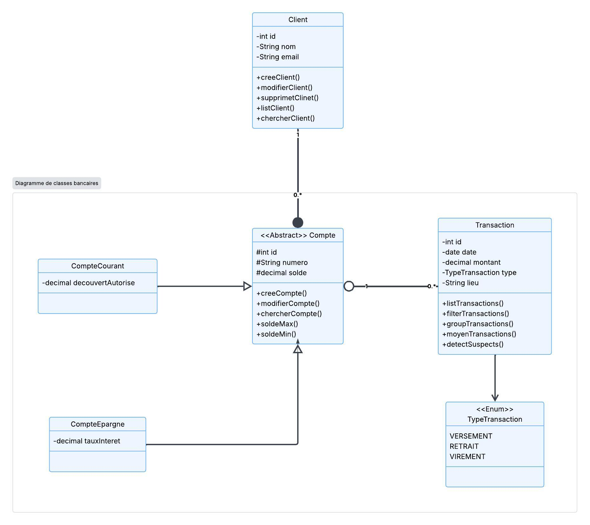

# SoluBank

Application bancaire en console développée en Java, connectée a une base de donnees PostgreSQL via JDBC. Elle permet de gerer les clients, leurs comptes et leurs transactions, et propose un ensemble de rapports et d'analyses.

## Fonctionnalites

- Gestion des clients (ajout, modification, suppression, liste, recherche par nom)
- Gestion des comptes (courants avec decouvert autorise, epargne avec taux d'interet)
- Gestion des transactions (ajout, modification, suppression, liste, groupement par type, somme par compte)
- Detection des transactions suspectes :
  - montant superieur a 1000
  - lieu different du lieu habituel du compte
  - plus de 3 transactions un meme jour
- Menu des rapports :
  - top 5 clients par solde
  - nombre de transactions par type
  - transactions suspectes
  - comptes inactifs

## Architecture

L'application est organisee en couches :

- `models` : entites (Client, Compte, CompteCourant, CompteEpargne, Transaction, TypeTransaction)
- `dao` : acces aux donnees (ClientDao, CompteDao, TransactionDao)
- `service` : logique metier (ClientService, CompteService, TransactionService, RapportService)
- `utils` : connexion a la base de donnees (Database)
- `Main.java` : interface console et menus

## Schema de classes



## Base de donnees

PostgreSQL, base `solbank`, connexion configuree dans `utils/Database.java`.

```
jdbc:postgresql://localhost/solbank?user=kaiser&password=kaiser
```

## Compilation et execution

```bash
javac -cp libraries/postgresql-42.7.13.jar -d out Main.java service/*.java models/*.java dao/*.java utils/*.java
java -cp out:libraries/postgresql-42.7.13.jar Main
```

## Dependance

- Driver JDBC PostgreSQL (`libraries/postgresql-42.7.13.jar`)